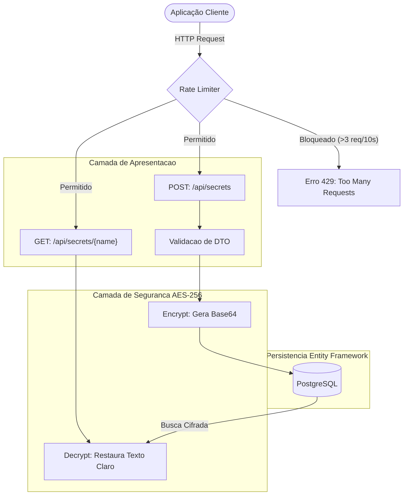

# 🔐 SecureVault API (Gerenciamento de Segredos M2M)

> Uma Web API robusta em .NET 8 projetada para comunicação Machine-to-Machine (M2M), oferecendo armazenamento persistente e criptografia ponta a ponta (AES-256) para credenciais sensíveis.


## 📋 Sobre o Projeto

O **SecureVault** é uma prova de conceito de um cofre digital de chaves (semelhante em propósito ao AWS Secrets Manager). Ele foi projetado para evitar que aplicações tenham senhas *hardcoded* em seus códigos-fonte. Uma aplicação cliente faz uma requisição HTTP, o Vault descriptografa a senha em tempo real e a devolve com segurança.

O projeto foi construído focando em **Segurança da Informação**, separação de responsabilidades (SOLID), resiliência contra ataques automatizados e alta cobertura de qualidade técnica.

---

## ⚙️ Arquitetura e Fluxo de Segurança

A aplicação utiliza o padrão N-Tier com injeção de dependência e garante que os segredos nunca transitem ou sejam salvos de forma vulnerável.



## 🚀 Tecnologias Utilizadas

* **Runtime:** .NET 8 (Web API / ControllerBase)
* **Banco de Dados:** PostgreSQL (Relacional e Escalável)
* **ORM:** Entity Framework Core (Code-First & Migrations)
* **Criptografia:** AES-256 Symmetrical (`System.Security.Cryptography`)
* **Defesa Perimetral:** ASP.NET Core Rate Limiting (Fixed Window)
* **Testes Unitários:** xUnit + Moq + EF Core InMemory Database
* **CI/CD:** GitHub Actions (Pipeline automatizado)
* **Container:** Docker & Docker Compose (Infraestrutura do Banco)

## 🛡️ Destaques de Segurança

O projeto não se limita apenas a salvar dados, mas aplica conceitos de defesa em profundidade:

1. **Criptografia Simétrica (AES-256):** Utiliza chaves de 256 bits (32 bytes) com conversão segura em *Streams* para Base64. A chave mestra não fica no código fonte, sendo injetada por variáveis de ambiente.
2. **Defesa contra Brute Force:** Implementação nativa de Rate Limiting. Limita as tentativas de acesso por IP, barrando ataques de Enumeração ou Dicionário.
3. **Data Transfer Objects (DTOs):** Previne ataques de *Over-Posting* ou injeção de IDs falsos ao isolar a entrada de dados da entidade real do banco.

## 🧪 Qualidade e Automação (CI/CD)

O sistema possui uma suíte de testes unitários focada no comportamento da camada de segurança e nas regras de apresentação:

* **Padrão AAA:** Testes estruturados em *Arrange, Act, Assert*.
* **Isolamento de Banco (Mocks):** Utilização do `Moq` para simular o Serviço de Criptografia e do `Microsoft.EntityFrameworkCore.InMemory` para testar os endpoints do Controller sem sujar o banco de dados principal.
* **Pipeline de CI:** Configurado via **GitHub Actions**. A cada *push* ou *pull request* na branch principal, um servidor Linux (Ubuntu) é provisionado automaticamente para restaurar pacotes, compilar o código de forma estrita e executar a bateria completa do xUnit.

## ⚙️ Configuração (Environment)

Para rodar o projeto, as variáveis devem estar configuradas no `appsettings.json` ou no ambiente. O repositório contém um `appsettings.example.json` como molde.

| Variável | Descrição | Regra |
|----------|-----------|-------|
| `ConnectionStrings:DefaultConnection` | String de conexão do PostgreSQL. | Deve apontar para o container local ou banco em nuvem. |
| `MasterKey` | Chave criptográfica usada pelo algoritmo AES. | **Obrigatório:** Deve conter exatos 32 caracteres (256 bits). |

---

## 🔧 Como Rodar

### 1. Subindo a Infraestrutura (Banco de Dados)

O banco de dados PostgreSQL está containerizado para facilitar o setup inicial. Na raiz do projeto, execute:
```bash
docker-compose up -d
```

### 2. Configurando as Chaves

Crie um arquivo chamado `appsettings.json` na pasta do projeto e adicione a sua chave mestra e conexão:
```json
{
  "ConnectionStrings": {
    "DefaultConnection": "Host=localhost;Port=5432;Database=Vault;Username=postgres;Password=suasenha"
  },
  "MasterKey": "COLOQUE_UMA_CHAVE_DE_32_BYTES_!!"
}
```

### 3. Rodando a Aplicação e Migrations

Certifique-se de ter o **.NET SDK 8.0** instalado. No terminal, aplique o banco e rode a API:
```bash
dotnet ef database update
dotnet run
```
Acesse o **Swagger** na URL informada no terminal (geralmente `http://localhost:5000/swagger`) para testar os endpoints interativamente.

## 🔮 Roadmap e Melhorias Futuras (V2.0+)

Como prova de conceito, este projeto mapeia as seguintes evoluções de arquitetura corporativa:

- [ ] **Zero Trust & Autenticação (JWT):** Implementar bloqueios com `[Authorize]` e validação de tokens JWT para impedir IDOR em redes internas.
- [ ] **Vetor de Inicialização (IV) Dinâmico:** Evoluir a lógica de criptografia para gerar IVs aleatórios (salt) salvos junto com o hash no banco, elevando a entropia do dado armazenado.

---
*Desenvolvido com foco em aprendizado e portfólio.*