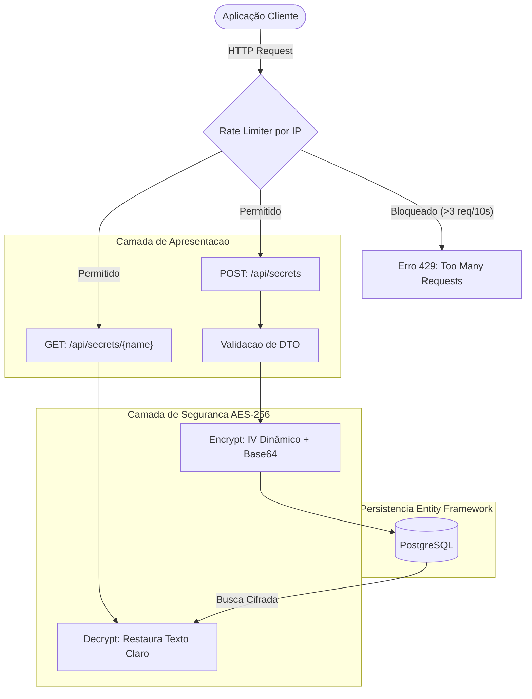

# 🔐 SecureVault API (Gerenciamento de Segredos M2M)

> Uma Web API robusta em .NET 8 projetada para comunicação Machine-to-Machine (M2M), oferecendo armazenamento persistente e criptografia ponta a ponta (AES-256) para credenciais sensíveis.


## 📋 Sobre o Projeto

O **SecureVault** é uma prova de conceito de um cofre digital de chaves (semelhante em propósito ao AWS Secrets Manager). Ele foi projetado para evitar que aplicações tenham senhas *hardcoded* em seus códigos-fonte. Uma aplicação cliente faz uma requisição HTTP, o Vault descriptografa a senha em tempo real e a devolve com segurança.

O projeto foi construído focando em **Segurança da Informação**, separação de responsabilidades (SOLID), resiliência contra ataques automatizados e alta cobertura de qualidade técnica.

---

## ⚙️ Arquitetura e Fluxo de Segurança

A aplicação utiliza o padrão N-Tier com injeção de dependência e garante que os segredos nunca transitem ou sejam salvos de forma vulnerável.



## 🚀 Tecnologias Utilizadas

* **Runtime:** .NET 8 (Web API / ControllerBase)
* **Banco de Dados:** PostgreSQL (Relacional e Escalável)
* **ORM:** Entity Framework Core (Code-First & Migrations)
* **Criptografia:** AES-256 Symmetrical (`System.Security.Cryptography`)
* **Defesa Perimetral:** ASP.NET Core Partitioned Rate Limiting (Por IP)
* **Testes Unitários:** xUnit + Moq + EF Core InMemory Database
* **CI/CD & DevSecOps:** GitHub Actions com Auditoria de Vulnerabilidades
* **Container:** Docker & Docker Compose (Infraestrutura do Banco)

## 🛡️ Destaques de Segurança

O projeto não se limita apenas a salvar dados, mas aplica conceitos de defesa em profundidade:

1. **Criptografia Simétrica com IV Dinâmico (AES-256):** Utiliza chaves de 256 bits acopladas a um Vetor de Inicialização (IV) gerado aleatoriamente a cada requisição. Isso eleva a entropia e previne ataques de análise de frequência direto no banco de dados.
2. **Defesa contra Brute Force (Fail-Fast):** Implementação nativa de *Partitioned Rate Limiting*. Limita rigorosamente as tentativas de acesso por IP individual, barrando ataques de Enumeração/IDOR sem causar Negação de Serviço (DoS) para usuários legítimos.
3. **Contratos Estritos (DTOs):** Uso de Data Transfer Objects para requisições e respostas, prevenindo ataques de *Over-Posting* e garantindo contratos de API limpos e previsíveis.

## 🧪 Qualidade e Automação (CI/CD)

O sistema possui uma esteira contínua focada em validação estrutural e segurança:

* **Padrão AAA e Isolamento (Mocks):** Utilização do `Moq` e `InMemoryDatabase` para testar os endpoints isolando completamente a camada de banco de dados.
* **Pipeline de CI (GitHub Actions):** A cada *push* ou *pull request*, um servidor provisionado restaura dependências, compila o código sem cache e executa a bateria de testes.
* **Auditoria SCA (Software Composition Analysis):** Verificação contínua automatizada na pipeline (`dotnet list package --vulnerable`) para impedir que bibliotecas com CVEs conhecidos cheguem à produção.

## ⚙️ Configuração (Environment)

Para rodar o projeto, as variáveis devem estar configuradas no `appsettings.json` ou no ambiente. O repositório contém um `appsettings.example.json` como molde.

| Variável | Descrição | Regra |
|----------|-----------|-------|
| `ConnectionStrings:DefaultConnection` | String de conexão do PostgreSQL. | Deve apontar para o container local ou banco em nuvem. |
| `MasterKey` | Chave criptográfica usada pelo algoritmo AES. | **Obrigatório:** Deve conter exatos 32 caracteres (256 bits). |

---

## 🔧 Como Rodar

### 1. Subindo a Infraestrutura (Banco de Dados)

O banco de dados PostgreSQL está containerizado para facilitar o setup inicial. Na raiz do projeto, execute:
```bash
docker-compose up -d
```

### 2. Configurando as Chaves

Crie um arquivo chamado `appsettings.json` na pasta do projeto e adicione a sua chave mestra e conexão:
```json
{
  "ConnectionStrings": {
    "DefaultConnection": "Host=localhost;Port=5432;Database=Vault;Username=postgres;Password=suasenha"
  },
  "MasterKey": "COLOQUE_UMA_CHAVE_DE_32_BYTES_!!"
}
```

### 3. Rodando a Aplicação e Migrations

Certifique-se de ter o **.NET SDK 8.0** instalado. No terminal, aplique o banco e rode a API:
```bash
dotnet ef database update
dotnet run
```
Acesse o **Swagger** na URL informada no terminal (geralmente `http://localhost:5000/swagger`) para testar os endpoints interativamente.

## 🔮 Roadmap e Melhorias Futuras

Como prova de conceito, este projeto mapeia as seguintes evoluções de arquitetura corporativa:

- [x] **Testes de Unidade (xUnit + Moq):** Cobertura de testes garantindo a integridade dos métodos de encriptação e isolamento do Controller.
- [x] **CI/CD Pipeline e DevSecOps:** Criação de *GitHub Actions* para execução automatizada da suíte de QA e auditoria de vulnerabilidades (SCA).
- [x] **Vetor de Inicialização (IV) Dinâmico:** Evolução da lógica de criptografia para gerar IVs aleatórios salvos junto com o hash no banco.
- [x] **Rate Limiting Particionado:** Defesa contra força bruta individualizada por IP (Fail-Fast).
- [ ] **Zero Trust & Autenticação (JWT):** Implementar bloqueios com `[Authorize]` e validação de tokens JWT para impedir IDOR em redes corporativas internas.

---
*Desenvolvido com foco em segurança da informação, arquitetura backend e cultura DevSecOps.*